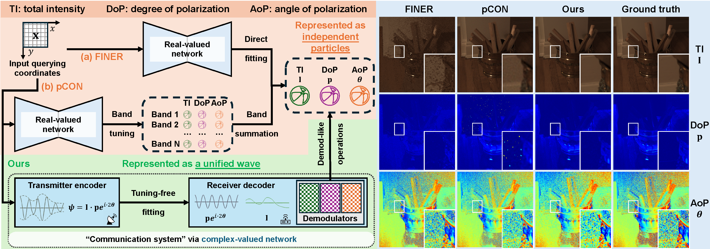

# Polarimetric Neural Field via Unified Complex-Valued Wave Representation

By [Chu Zhou](https://fourson.github.io/), Yixin Yang, Junda Liao, Heng Guo, [Boxin Shi](http://ci.idm.pku.edu.cn/), [Imari Sato](https://research.nii.ac.jp/pbv/)


[PDF]() | [SUPP]()

## Abstract
Polarization has found applications in various computer vision tasks by providing additional physical cues. However, due to the limitations of current imaging systems, polarimetric parameters are typically stored in discrete form, which is non-differentiable and limits their applicability in polarization-based vision. While current neural field methods have shown promise for continuous signal reconstruction, they struggle to model the intrinsic physical interdependencies among polarimetric parameters. In this work, we propose a physics-grounded representation scheme to represent polarimetric parameters as a unified complex-valued wave. Tailored to this scheme, we propose a tuning-free fitting strategy along with a lightweight complex-valued neural network, enabling property-preserved reconstruction. Experimental results show that our method achieves state-of-the-art performance and facilitates smooth polarized image rendering and flexible resolution adjustments.

## Prerequisites
* Linux Distributions (tested on Ubuntu 20.04).
* NVIDIA GPU and CUDA cuDNN
* Python >= 3.7
* Pytorch >= 1.10.0
* cv2
* numpy
* tqdm
* tensorboardX (for training visualization)

## Inference
* Download the [dataset](https://1drv.ms/f/c/a7790f0fe4911ab5/Er2hzvpvg9lAkmGMu6FtrNIBMx7fLmI98ISQZfe51cQe8Q?e=bQmF0g), containing the paper_scenes provided by [pCON](https://visual.ee.ucla.edu/pcon.htm/)
* Download the [pre-trained models](https://1drv.ms/f/c/a7790f0fe4911ab5/EsFOvG6IqiRFhfWT3c3pTqoBRqE8or0_5Ihht31gUO4bPA?e=KUnoPq) for each scene 
* Use `python execute/infer_full.py -r checkpoint/<scene_name.pth> --data_dir pCON_data/paper_scenes --result_dir <path_to_result_data> --data_loader_type PCONDataLoader default` for inference
* The metrics will be automatically calculated after inference

## Training
* Run `python execute/train.py -c config/<scene_name.json>`

## Citation
If you find this work helpful to your research, please cite:
```
@inproceedings{zhou2025polarimetric,
  title = {Polarimetric neural field with unified complex-valued wave representation},
  author = {Zhou, Chu and Yang, Yixin and Liao, Junda and Guo, Heng and Shi, Boxin and Sato, Imari},
  booktitle = Proceedings of the IEEE/CVF International Conference on Computer Vision,
  pages = {},
  year = {2025}
}
```
